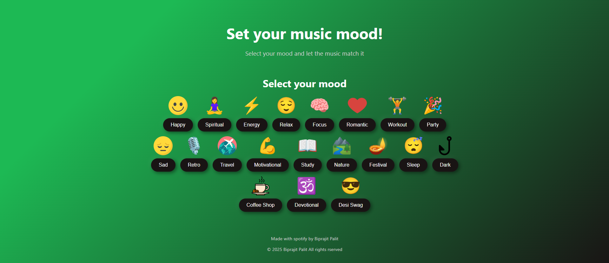

# 🎵 Mood-Based Spotify Playlist Recommender

This is a simple web-based project that allows users to select their current mood and instantly get a curated Spotify playlist that matches it.

## 📷 Preview



## 🚀 Features

- 20+ mood options like Happy, Sad, Romantic, Workout, Focus, etc.
- Each mood button redirects to a Spotify playlist suited for that emotion.
- Visually appealing mood emojis and animated UI.
- Built using **HTML** and **CSS** (no JavaScript required).
- Fully responsive and mobile-friendly.

## 🛠 Tech Stack

- HTML5
- CSS3
- Spotify Public Playlists

## 📁 Folder Structure

```

/
├── index.html
├── style.css
├── preview\.png
└── README.md

````

## 📦 How to Run Locally

1. Clone the repository:
   ```bash
   git clone https://github.com/your-username/music-mood-ui.git

2. Open `index.html` in your browser.

> No installation or setup required — everything runs in the browser!
``
## 📌 Use Case

Perfect for:

* Beginners building a frontend portfolio.
* Creating mood-based music experiences.
* Anyone looking for a fun way to explore Spotify playlists.

## 🔗 [ 🌐 Live Demo](https://biprajit-palit.github.io/spotify-mood-player/)


## 👤 Author

Made with ❤️ and Spotify by **Biprajit Palit**

---

© 2025 Biprajit Palit. All rights reserved.Live Demo](https://biprajit-palit.github.io/spotify-mood-player/)**


